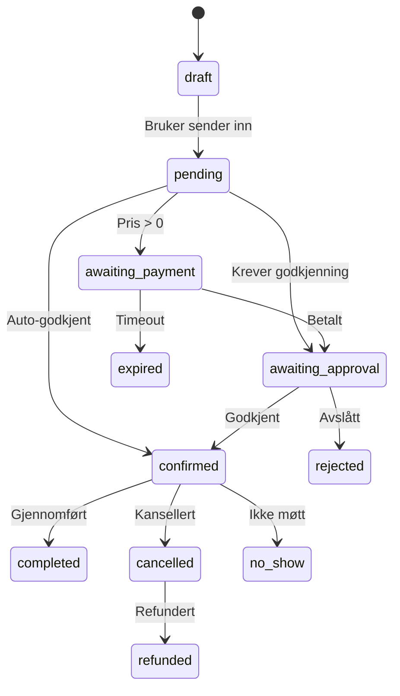

# Løsningsforslag: Digilist - Kommunal Bookingplattform

**Versjon:** 1.0\
**Dato:** Januar 2026\
**Status:** Produksjonsklar\
**Forfatter:** Xala Technologies AS

---

## 1. Innledning

### 1.1 Sammendrag

Digilist er en moderne SaaS-plattform som digitaliserer og effektiviserer
booking av kommunale anlegg og ressurser i Norge. Løsningen håndterer hele
verdikjeden fra publisering av ledige tider, gjennom bookingprosess med
betaling, til rapportering og etterlevelse av norske lover og forskrifter.

### 1.2 Målsetning

Denne løsningen skal:

1. **Forenkle tilgang** - Innbyggere, lag og foreninger får én digital inngang
   til alle kommunale anlegg
2. **Effektivisere saksbehandling** - Automatiserte godkjenningsflyter reduserer
   manuelt arbeid med 60%+
3. **Sikre likebehandling** - Transparente regler for prising og tildeling
4. **Oppfylle regelverkskrav** - GDPR, Offentleglova, Arkivlova, universell
   utforming

### 1.3 Omfang

| Område        | Beskrivelse                                                                    |
| ------------- | ------------------------------------------------------------------------------ |
| **Målgruppe** | Norske kommuner (primært), fylkeskommuner, interkommunale selskaper            |
| **Brukere**   | Innbyggere, lag/foreninger, idrettsklubber, skoler, næringsliv, saksbehandlere |
| **Anlegg**    | Idrettshaller, svømmehaller, kulturhus, møterom, utstyr, båter, kjøretøy       |

---

## 2. Funksjonell Løsning

### 2.1 Anleggshåndtering (Listing Management)

#### 2.1.1 Seks Anleggstyper

Plattformen støtter seks distinkte anleggstyper, hver optimalisert for
spesifikke bruksområder:

| Type       | Norsk Betegnelse | Eksempler                            | Booking-modell    |
| ---------- | ---------------- | ------------------------------------ | ----------------- |
| `SPACE`    | Rom/Hall         | Idrettshall, møterom, kultursal      | TIME_RANGE, SLOTS |
| `RESOURCE` | Ressurs          | Projektor, sportsutstyr, bord/stoler | QUANTITY          |
| `EVENT`    | Arrangement      | Konserter, kurs, workshops           | CAPACITY          |
| `SERVICE`  | Tjeneste         | Vaktmester, renhold, catering        | TIME_RANGE        |
| `VEHICLE`  | Kjøretøy         | Kommunebiler, båter, sykler          | ALL_DAY           |
| `OTHER`    | Annet            | Spesialtilpassede bookinger          | Alle modeller     |

#### 2.1.2 Seks Booking-Modeller

| Modell       | Beskrivelse          | Bruksområde                           |
| ------------ | -------------------- | ------------------------------------- |
| `TIME_RANGE` | Start- og sluttid    | Standard timebookinger                |
| `SLOTS`      | Predefinerte tidsluk | Faste treningstider, kurs             |
| `ALL_DAY`    | Heldags booking      | Arrangement, konferanser              |
| `QUANTITY`   | Antallsbasert        | Utstyr, ressurser                     |
| `CAPACITY`   | Kapasitetsbasert     | Arrangementer med deltagerbegrensning |
| `PACKAGE`    | Pakkeløsninger       | Komplette arrangementer               |

#### 2.1.3 Booking Units (Bookbare Enheter)

Listing Standard v1 introduserer **Bookable Units** som gir:

- Flere bookbare enheter per anlegg (f.eks. "Hele hallen" vs "Halv hall")
- Individuelle priser per enhet
- Egne tidsregler per enhet
- Separat kapasitet og inventar

```
Skien Idrettshall (Listing)
├── Hele hallen (Bookable Unit) - 2000 kr/time
└── Halv hall (Bookable Unit) - 1100 kr/time
```

### 2.2 Bookingmotor

#### 2.2.1 Unified Booking Engine

Én felles bookingmotor håndterer alle seks booking-modeller gjennom:

- **bookings** - Hovedtabell med felles felter
- **booking_items** - Linjeartikler med snapshot av anleggsinformasjon
- **allocations** - Tidsblokker for kalendervisning og konfliktsjekk

#### 2.2.2 Booking-Livssyklus



#### 2.2.3 Sesongutleie

Spesialisert funksjon for sesongbasert tildeling med:

- Søknadsfrister og varsling
- Regelbasert prioritering (idrettslag før privatpersoner)
- Konfliktsjekk på tvers av søknader
- Manuell justering av forslag
- Statusflyt: `søknad_sendt` → `godkjent` → `tildelt` → `bekreftet`

### 2.3 Brukertyper og Prising

#### 2.3.1 Seks Brukergrupper (Actor Types)

| Brukergruppe   | Norsk        | Rabatt   | Verifisering      |
| -------------- | ------------ | -------- | ----------------- |
| `privatperson` | Privatperson | 0%       | Nei               |
| `naringsliv`   | Næringsliv   | 0%       | BRREG (valgfritt) |
| `forening`     | Lag/Forening | Varierer | Ja                |
| `idrettslag`   | Idrettslag   | 30-70%   | NIF               |
| `skole`        | Skole        | 100%     | Ja                |
| `kommune`      | Kommune      | 100%     | Ja                |

#### 2.3.2 Prisberegning

Prismodellen støtter:

- **Grunnpris** per bookbar enhet
- **Perioderegler** (helg, kveld, helligdager)
- **Brukergrupperabatter** (automatisk basert på innlogget bruker)
- **Rabattkoder** (kampanjer, partnere)
- **Tilleggstjenester** (renhold, vaktmester, catering)

### 2.4 Godkjenningsflyt

#### 2.4.1 Fire Godkjenningsmoduser

| Modus               | Beskrivelse                      | Bruksområde                    |
| ------------------- | -------------------------------- | ------------------------------ |
| `auto_approve`      | Umiddelbar bekreftelse           | Lave verdier, korte bookinger  |
| `approval_required` | Krever saksbehandler             | Høye verdier, sensitive anlegg |
| `instant_paid`      | Bekreft etter betaling           | Kommersielle bookinger         |
| `hybrid`            | Auto for noen, manuelt for andre | Blandet bruk                   |

#### 2.4.2 Regelbasert Godkjenning

Konfigurerbare regler basert på:

- Varighet (f.eks. > 4 timer krever godkjenning)
- Pris (f.eks. > 5000 NOK krever godkjenning)
- Brukergruppe (verifiserte organisasjoner auto-godkjennes)
- Tidspunkt (helgebookinger krever godkjenning)

### 2.5 Betaling

#### 2.5.1 Betalingsløsninger

| Leverandør  | Type        | Prioritet | Status       |
| ----------- | ----------- | --------- | ------------ |
| **Vipps**   | Mobil       | P0        | Implementert |
| **Nets**    | Kort        | P1        | Planlagt     |
| **Faktura** | ERP         | P1        | Planlagt     |
| **Manuell** | Kasse/Sjekk | P2        | Planlagt     |

#### 2.5.2 Refusjon

Automatisk refusjonsberegning basert på kanselleringspolicy:

- Full refusjon ved kansellering > 48 timer før
- 50% refusjon ved 24-48 timer før
- Ingen refusjon ved < 24 timer før
- Konfigurerbar per anlegg

### 2.6 Tilleggstjenester (Add-ons)

Seed-data inkluderer 27 norske tilleggstjenester:

**Personell:**

- Vaktmester (500 kr/time)
- Dommer (750 kr/booking)
- Ordensvakt (600 kr/time)
- Lydtekniker (800 kr/time)

**Renhold/Klargjøring:**

- Renhold etter arrangement (1000 kr)
- Klargjøring før arrangement (750 kr)

**Utstyr:**

- Ekstra stoler (20 kr/stk)
- Lydanlegg (1500 kr)
- Prosjektor (500 kr)

**Servering:**

- Kaffe/te (35 kr/person)
- Lunsjservering (225 kr/person)
- Full catering (på forespørsel)

---

## 3. Teknisk Arkitektur

### 3.1 Systemarkitektur

```
┌─────────────────────────────────────────────────────────────────────┐
│                        DIGILIST PLATFORM                            │
├─────────────────────────────────────────────────────────────────────┤
│                                                                     │
│  ┌─────────────┐  ┌─────────────┐  ┌─────────────┐  ┌───────────┐ │
│  │   Web App   │  │  Backoffice │  │ Learning Hub│  │   Docs    │ │
│  │  (RR7/RC19) │  │  (RR7)      │  │  (RR7)      │  │  (RR7)    │ │
│  └──────┬──────┘  └──────┬──────┘  └──────┬──────┘  └─────┬─────┘ │
│         │                │                │                │       │
│         └────────────────┴────────────────┴────────────────┘       │
│                                   │                                 │
│                          ┌───────▼───────┐                         │
│                          │   API Server  │                         │
│                          │  (Fastify 5)  │                         │
│                          └───────┬───────┘                         │
│                                  │                                  │
│         ┌────────────────────────┼────────────────────────┐        │
│         │                        │                        │        │
│  ┌──────▼──────┐          ┌──────▼──────┐          ┌──────▼──────┐│
│  │ PostgreSQL  │          │    Redis    │          │   Worker    ││
│  │     16      │          │    7.x      │          │  (BullMQ)   ││
│  └─────────────┘          └─────────────┘          └─────────────┘│
│                                                                     │
└─────────────────────────────────────────────────────────────────────┘
```

### 3.2 Teknologivalg

| Komponent    | Teknologi            | Versjon | Begrunnelse             |
| ------------ | -------------------- | ------- | ----------------------- |
| **Frontend** | React + React Router | 19 / 7  | Moderne, SSR-støtte     |
| **API**      | Fastify              | 5.x     | Rask, TypeScript-støtte |
| **Database** | PostgreSQL           | 16.x    | ACID, JSON, Range-typer |
| **ORM**      | Drizzle              | 0.30.x  | Type-sikker, performant |
| **Cache**    | Redis                | 7.x     | Sessions, køer, cache   |
| **Worker**   | BullMQ               | -       | Bakgrunnsjobber         |
| **Språk**    | TypeScript           | 5.x     | Strict mode             |
| **Monorepo** | pnpm + Turbo         | -       | Effektiv arbeidsflyt    |

### 3.3 Databaseskjema

Fire logiske skjemaer med streng isolasjon:

```sql
-- Plattformtjenester (autentisering, autorisasjon, organisasjoner)
CREATE SCHEMA platform;

-- Domenelogikk (bookinger, anlegg, betalinger)
CREATE SCHEMA domain;

-- Overvåkning og QA
CREATE SCHEMA monitoring;

-- Delte ressurser (filer, assets)
CREATE SCHEMA cross_cutting;
```

### 3.4 Applikasjoner

| App            | Port | Formål          | Teknologi      |
| -------------- | ---- | --------------- | -------------- |
| `web`          | 8000 | Publikumsportal | React Router 7 |
| `api`          | 4000 | REST API        | Fastify 5      |
| `backoffice`   | 8001 | Saksbehandling  | React Router 7 |
| `monitoring`   | 8004 | QA Dashboard    | React Router 7 |
| `docs`         | 8002 | Dokumentasjon   | React Router 7 |
| `learning-hub` | 8003 | Opplæring       | React Router 7 |
| `saas`         | 8005 | Tenant Admin    | React Router 7 |
| `worker`       | 4001 | Bakgrunnsjobber | BullMQ         |

### 3.5 Pakkehierarki (Monorepo)

```
packages/
├── server/
│   ├── data/              # Drizzle ORM, skjemaer
│   ├── platform-data/     # Plattform-skjema
│   └── monitoring-data/   # Overvåkning-skjema
│
├── shared/
│   ├── ui/               # Delt UI-bibliotek (@shared/ui)
│   ├── i18n/             # Internasjonalisering
│   ├── validation/       # Zod-skjemaer
│   └── contracts/        # Felles kontrakter (DTOs)
│
├── domain/
│   └── listings/         # Domenelogikk for anlegg
│
└── client/
    ├── api-client/       # API-klient
    └── domain-hooks/     # React Query hooks
```

---

## 4. Integrasjoner

### 4.1 Norske Offentlige Tjenester

| Integrasjon   | Formål                                | Prioritet | Status      |
| ------------- | ------------------------------------- | --------- | ----------- |
| **ID-porten** | Nasjonal autentisering (BankID/MinID) | P0        | I utvikling |
| **BRREG**     | Verifisering av organisasjoner        | P1        | Planlagt    |
| **NIF**       | Verifisering av idrettslag            | P1        | Planlagt    |
| **Altinn**    | Offisiell kommunikasjon               | P2        | Planlagt    |

### 4.2 Betalingsløsninger

| Leverandør | Integrasjonstype    | Prioritet |
| ---------- | ------------------- | --------- |
| **Vipps**  | REST API + Webhooks | P0        |
| **Nets**   | Card Payment API    | P1        |
| **Visma**  | Faktura/ERP         | P2        |

### 4.3 Kalenderintegrasjoner

- iCal-feed for personlige bookinger
- Google Calendar (ett-klikk)
- Microsoft Outlook (Graph API)
- Organisasjonskalender-feed

### 4.4 Tilgangssystemer

| System    | Formål             | Prioritet |
| --------- | ------------------ | --------- |
| **RCO**   | Låskodegenerering  | P1        |
| **Salto** | Elektroniske låser | P2        |
| **NFC**   | Mobiladgang        | P2        |

---

## 5. Sikkerhet og Etterlevelse

### 5.1 Autentisering

- **ID-porten** (BankID, MinID) for sikkerhetsnivå 3/4
- OAuth-leverandører for utvikling
- Sesjonsbasert autentisering med httpOnly cookies
- 8 timers sesjonstimeout (konfigurerbart)

### 5.2 Autorisasjon (RBAC)

Fire nivåer av tilgangskontroll:

| Scope    | Beskrivelse      | Eksempel-rettigheter                     |
| -------- | ---------------- | ---------------------------------------- |
| `user`   | Personlig portal | Se egne bookinger, opprette booking      |
| `org`    | Organisasjon     | Administrere anlegg, godkjenne bookinger |
| `tenant` | Kommune          | Administrere organisasjoner, fakturering |
| `saas`   | Platform         | Administrere tenants, systemkonfig       |

### 5.3 Datasikkerhet

| Tiltak               | Beskrivelse                 |
| -------------------- | --------------------------- |
| **TLS 1.3**          | All trafikk kryptert        |
| **AES-256**          | Persondata kryptert i hvile |
| **CSRF**             | Token-basert beskyttelse    |
| **XSS**              | CSP-headers, sanitering     |
| **SQL Injection**    | ORM-basert, parameterisert  |
| **Rate Limiting**    | 100 req/min per IP          |
| **Input Validation** | Zod-skjemaer                |

### 5.4 GDPR-Etterlevelse

| Artikkel   | Krav                 | Implementasjon                          |
| ---------- | -------------------- | --------------------------------------- |
| Art. 6     | Samtykke             | Eksplisitt aksept av vilkår per booking |
| Art. 12-14 | Informasjonsplikt    | Personvernerklæring, formålsbeskrivelse |
| Art. 15    | Innsyn               | Eksport av brukerdata (JSON)            |
| Art. 16    | Retting              | Bruker kan oppdatere profil             |
| Art. 17    | Sletting             | Anonymisering på forespørsel            |
| Art. 20    | Dataportabilitet     | JSON-eksport innen 30 dager             |
| Art. 30    | Behandlingsprotokoll | Automatisk loggføring                   |
| Art. 32    | Sikkerhet            | Kryptering, tilgangskontroll            |

### 5.5 Datalagringsregler

| Datatype        | Oppbevaringstid | Begrunnelse    |
| --------------- | --------------- | -------------- |
| Brukerkontoer   | Til sletting    | Tjenestebehov  |
| Bookinger       | 7 år            | Regnskap/skatt |
| Betalinger      | 7 år            | Regnskap/skatt |
| Revisjonslogger | 10 år           | Etterlevelse   |
| Sesjonsdata     | 30 dager        | Sikkerhet      |

### 5.6 Offentleglova

- Klassifisering av dokumenter
- Håndtering av innsynsbegjæringer
- Arkivverdig format for langtidslagring

### 5.7 Universell Utforming

| Krav               | Standard     | Status          |
| ------------------ | ------------ | --------------- |
| WCAG 2.1 AA        | Minimum      | ✅ Implementert |
| Tastaturnavigasjon | Obligatorisk | ✅ Implementert |
| Skjermleser        | ARIA-labels  | ✅ Implementert |
| Fargekontrast      | 4.5:1        | ✅ Implementert |
| Fokusindikatorer   | Synlig       | ✅ Implementert |
| Berøringsmål       | 44x44px      | ✅ Implementert |

---

## 6. Testing og Kvalitetssikring

### 6.1 Teststrategi

```
┌─────────────────────────────────────────────────────────┐
│                  TESTING PYRAMID                        │
├─────────────────────────────────────────────────────────┤
│                                                         │
│                    ▲ E2E Tests                         │
│                   ╱ ╲ (Journey Tests)                  │
│                  ╱   ╲                                 │
│                 ╱     ╲                                │
│                ▲───────▲ Integration Tests             │
│               ╱         ╲ (Scenario Tests)             │
│              ╱           ╲                             │
│             ╱             ╲                            │
│            ▲───────────────▲ Unit Tests               │
│           ╱                 ╲ (Vitest)                 │
│          ╱___________________╲                         │
│                                                         │
└─────────────────────────────────────────────────────────┘
```

### 6.2 Testtyper

| Type              | Verktøy            | Dekningsgrad    | Formål          |
| ----------------- | ------------------ | --------------- | --------------- |
| **Unit**          | Vitest             | >95%            | Domenelogikk    |
| **Integration**   | Vitest + Supertest | >90%            | API-endepunkter |
| **Scenario**      | Scenario Hub       | 76 assertions   | Brukerhistorier |
| **E2E/Journey**   | Playwright         | Kritiske flyter | Brukerreiser    |
| **Accessibility** | axe-core           | WCAG 2.1 AA     | Tilgjengelighet |
| **Security**      | Semgrep, Gitleaks  | All kode        | Sårbarheter     |
| **Performance**   | Lighthouse         | Core Web Vitals | Ytelse          |

### 6.3 Kravsporing

Alle krav spores gjennom `requirements.json`:

```json
{
    "id": "DOM-001",
    "title": "Listing as ONLY Bookable Entity",
    "priority": "P0",
    "status": "covered",
    "traceability": {
        "schema": ["listings.ts"],
        "api": ["listings-routes.ts"],
        "services": ["listing.service.ts"],
        "hooks": ["useListing.ts"],
        "frontend": ["ListingCard.tsx"],
        "tests": ["listing.test.ts"]
    }
}
```

### 6.4 Overvåkning

**Monitoring Dashboard** (apps/monitoring) gir:

- Sanntids kravstatus
- Testkjøringshistorikk
- Journey-rapporter
- Dekningsmålinger
- Sikkerhetsalarmer

---

## 7. Infrastruktur og Drift

### 7.1 Produksjonsmiljø

| Komponent           | Spesifikasjon           |
| ------------------- | ----------------------- |
| **Leverandør**      | Hostinger VPS           |
| **Lokasjon**        | Nederland (EU)          |
| **Node.js**         | 20.x LTS                |
| **Process Manager** | PM2 v6.x                |
| **Web Server**      | Nginx (Reverse Proxy)   |
| **SSL**             | Let's Encrypt (Certbot) |
| **Database**        | PostgreSQL 16           |
| **Cache**           | Redis 7.x               |

### 7.2 Subdomener

| Subdomen              | Formål          |
| --------------------- | --------------- |
| `digilist.no`         | Publikumsportal |
| `api.digilist.no`     | REST API        |
| `admin.digilist.no`   | Backoffice      |
| `docs.digilist.no`    | Dokumentasjon   |
| `learn.digilist.no`   | Opplæring       |
| `monitor.digilist.no` | Overvåkning     |

### 7.3 Deployment

**Single-App Deployment Protocol:**

```bash
./infra/deploy/scripts/deploy.sh production api
```

Fire faser:

1. **Build** - Lokal bundling (tsup for API)
2. **Package** - Opprett deployment-pakke
3. **Sync** - Overfør til VPS (rsync)
4. **Activate** - PM2 restart + helsesjekk

### 7.4 Database Lifecycle

```bash
# Lokal utvikling
./scripts/recreate-db.sh

# Produksjon (via SSH-tunnel)
ssh -L 5433:localhost:5432 root@72.61.23.56
DATABASE_URL="..." pnpm db:push
```

### 7.5 Backup

| Type          | Frekvens | Oppbevaring |
| ------------- | -------- | ----------- |
| Full database | Daglig   | 30 dager    |
| Inkrementell  | Time     | 7 dager     |
| Offsite       | Ukentlig | 90 dager    |

---

## 8. Ytelsesmål

### 8.1 Tekniske Mål

| Metrikk              | Mål     | Måling              |
| -------------------- | ------- | ------------------- |
| Page Load (LCP)      | < 2.5s  | Core Web Vitals     |
| Time to Interactive  | < 3.5s  | Lighthouse          |
| API Response (p50)   | < 200ms | Applikasjonsmonitor |
| API Response (p95)   | < 500ms | Applikasjonsmonitor |
| Database Query (p95) | < 100ms | Database-monitor    |
| Samtidige brukere    | 1000+   | Lasttesting         |
| Tilgjengelighet      | 99.9%   | Oppetidsmonitor     |

### 8.2 Forretningsmål

| Metrikk                 | År 1    | År 2    |
| ----------------------- | ------- | ------- |
| Registrerte brukere     | 10 000+ | 25 000+ |
| Månedlig aktive brukere | 5 000+  | 15 000+ |
| Online booking-rate     | > 80%   | > 90%   |
| Auto-godkjenningsrate   | > 60%   | > 70%   |
| Anleggsutnyttelse       | > 70%   | > 80%   |

---

## 9. Prosjektplan

### 9.1 Fase 1: Grunnmur (Q1 2025) - MVP ✅

**Levert:**

- ✅ Bookingmotor (alle 6 modeller)
- ✅ Anleggshåndtering (alle 6 typer)
- ✅ Brukerautentisering
- ✅ Grunnleggende godkjenningsflyt
- ✅ E-postvarsling
- ✅ Multi-tenant arkitektur
- ✅ RBAC og tilgangskontroll

### 9.2 Fase 2: Betaling og Skalering (Q2 2025)

**Planlagt:**

- Vipps-integrasjon
- Fakturagenerering
- Gjentakende bookinger
- Offentlig kalender
- Mobiloptimalisert webapp
- Avansert søk og filtrering

### 9.3 Fase 3: Avanserte Funksjoner (Q3 2025)

**Planlagt:**

- Regelmotor-utvidelser
- Avansert rapportering
- RCO-integrasjon (låskoder)
- Sesongutleie-tildeling
- Kalenderintegrasjoner
- BRREG og NIF-verifisering

### 9.4 Fase 4: Enterprise (Q4 2025)

**Planlagt:**

- Tverrkommunal booking
- Offentlig API
- Avansert analyse-dashboard
- Tilpasset merkevare per tenant
- White-label støtte

---

## 10. Risikohåndtering

### 10.1 Identifiserte Risikoer

| Risiko                 | Sannsynlighet | Konsekvens | Tiltak                               |
| ---------------------- | ------------- | ---------- | ------------------------------------ |
| ID-porten forsinkelser | Medium        | Høy        | Tidlig oppstart, testmiljø           |
| Vipps API-endringer    | Lav           | Medium     | Overvåk changelog, abstraksjon       |
| GDPR-brudd             | Lav           | Høy        | Juridisk gjennomgang, automatisering |
| Ytelse ved skala       | Medium        | Medium     | Lasttesting, skalering               |
| Brukeradopsjon         | Medium        | Høy        | Opplæring, pilotprogram              |
| Datamigrasjon          | Lav           | Medium     | Migrasjonsskript, rollback-plan      |

### 10.2 Risikoppfølging

- **Månedlig risikogjennomgang** - Produkt og teknisk ledelse
- **Kvartalsvis risikovurdering** - Full interessentgjennomgang
- **Risikoregister** - Vedlikeholdes i prosjektstyringssystem

---

## 11. Vedlegg

### A. Ordliste

| Begrep            | Definisjon                                          |
| ----------------- | --------------------------------------------------- |
| **Tenant**        | Kommune eller organisasjon som bruker Digilist      |
| **Listing**       | Bokbart anlegg (idrettshall, møterom, utstyr, etc.) |
| **Bookable Unit** | Underenhet av et anlegg som kan bookes separat      |
| **Actor Type**    | Prisgruppe basert på organisasjonstype              |
| **Allocation**    | Tidsblokk-allokering for kalender                   |
| **Booking Model** | Hvordan en booking struktureres                     |

### B. Referanser

- [ID-porten Dokumentasjon](https://docs.digdir.no/)
- [Vipps API](https://developer.vippsmobilepay.com/)
- [BRREG API](https://data.brreg.no/)
- [GDPR Retningslinjer](https://datatilsynet.no/)
- [WCAG 2.1](https://www.w3.org/WAI/WCAG21/)

### C. Dokumenthistorikk

| Versjon | Dato        | Forfatter         | Endringer      |
| ------- | ----------- | ----------------- | -------------- |
| 1.0     | Januar 2026 | Xala Technologies | Første versjon |

---

_Sist oppdatert: Januar 2026_\
_Neste gjennomgang: Februar 2026_
