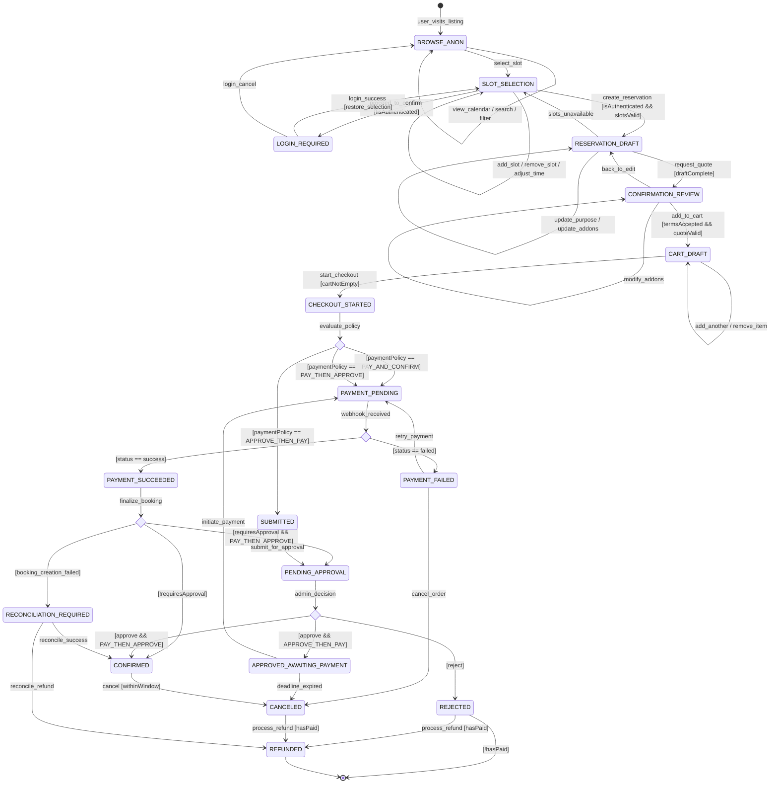

---
source: docs/knowledge_base/requirements/BOOKING_FLOW_STATE_MACHINE.md
auto_indexed: true
indexed_at: 2025-12-27T01:56:47.200Z
---

---
source: digilist/docs/plans/BOOKING_FLOW_STATE_MACHINE.md
auto_indexed: true
indexed_at: 2025-12-27T01:56:47.175Z
---

# Digilist Booking Flow - State Machine

> DELIVERABLE 1: State Machine Diagram
>
> **Implementation Status:** ✅ COMPLETE (2025-12-23)
> - States defined in `db/schema/reservations.ts`
> - Transitions in `core/services/booking-workflow.ts`
> - See `BOOKING_FLOW_IMPLEMENTATION_STATUS.md` for details



## State Descriptions

| State | Description |
|-------|-------------|
| `BROWSE_ANON` | Anonymous browsing, no login required |
| `SLOT_SELECTION` | Selecting time slots on calendar |
| `LOGIN_REQUIRED` | Authentication gate before confirmation |
| `RESERVATION_DRAFT` | Server-side draft created |
| `CONFIRMATION_REVIEW` | Reviewing quote, addons, terms |
| `CART_DRAFT` | Items in cart |
| `CHECKOUT_STARTED` | Checkout initiated |
| `PAYMENT_PENDING` | Awaiting payment webhook |
| `PAYMENT_SUCCEEDED` | Payment verified |
| `PAYMENT_FAILED` | Payment failed |
| `SUBMITTED` | Submitted for approval (no payment yet) |
| `PENDING_APPROVAL` | Awaiting admin decision |
| `APPROVED_AWAITING_PAYMENT` | Approved, needs payment |
| `CONFIRMED` | Booking confirmed |
| `REJECTED` | Admin rejected |
| `CANCELED` | Booking canceled |
| `REFUNDED` | Payment refunded |
| `RECONCILIATION_REQUIRED` | Payment OK but booking failed |

## Guard Conditions

```typescript
interface BookingGuards {
  isAuthenticated: boolean;
  slotsValid: boolean;
  availabilityValid: boolean;
  termsAccepted: boolean;
  termsVersion: string;
  quoteValid: boolean;
  cartNotEmpty: boolean;
  requiresApproval: boolean;
  paymentPolicy: 'PAY_AND_CONFIRM' | 'APPROVE_THEN_PAY' | 'PAY_THEN_APPROVE';
  hasPaid: boolean;
  withinCancellationWindow: boolean;
}
```

## Events

| Event | Description |
|-------|-------------|
| `select_slot` | User clicks available slot |
| `create_reservation` | Confirm slot selection |
| `request_quote` | Get server-side pricing |
| `accept_terms` | Accept terms checkbox |
| `add_to_cart` | Add reservation to cart |
| `start_checkout` | Begin checkout process |
| `webhook_received` | Payment provider callback |
| `submit_for_approval` | Submit to admin queue |
| `approve` | Admin approves |
| `reject` | Admin rejects |
| `cancel` | User/admin cancels |
| `refund` | Process refund |
