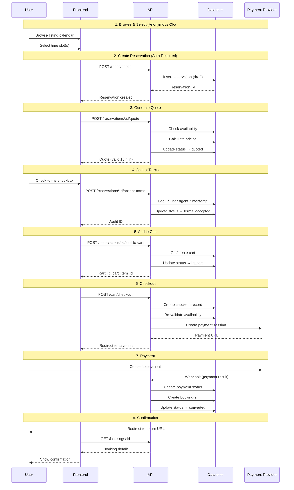
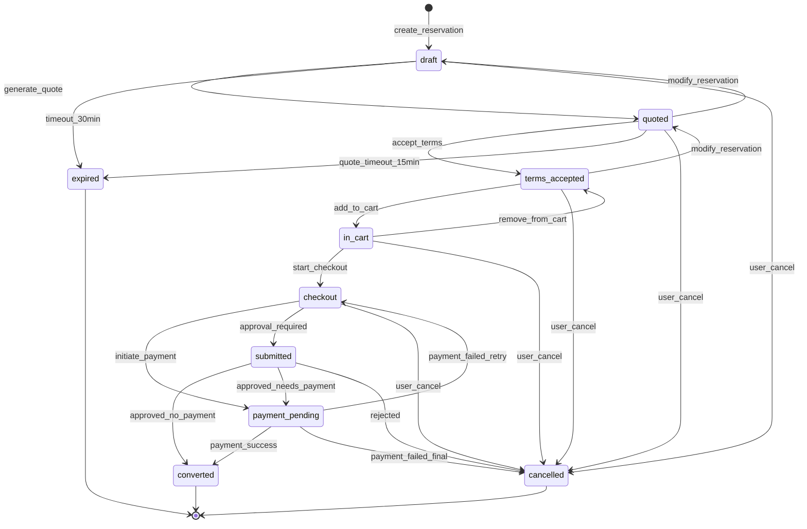
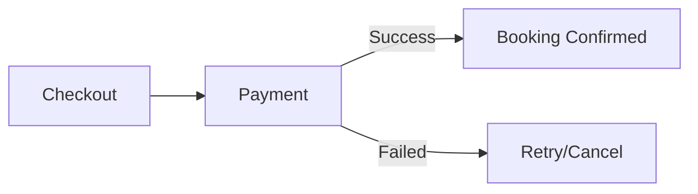
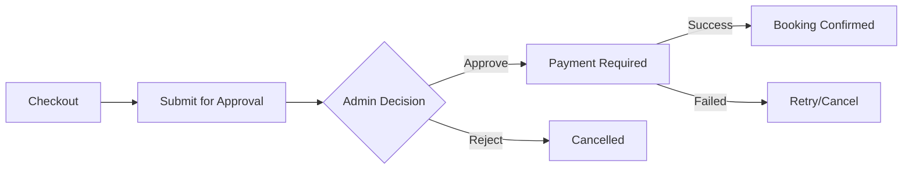
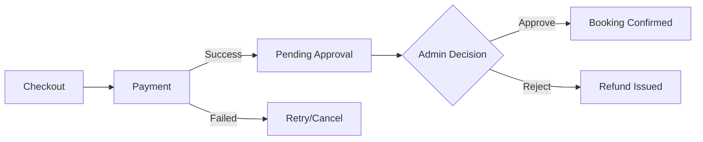
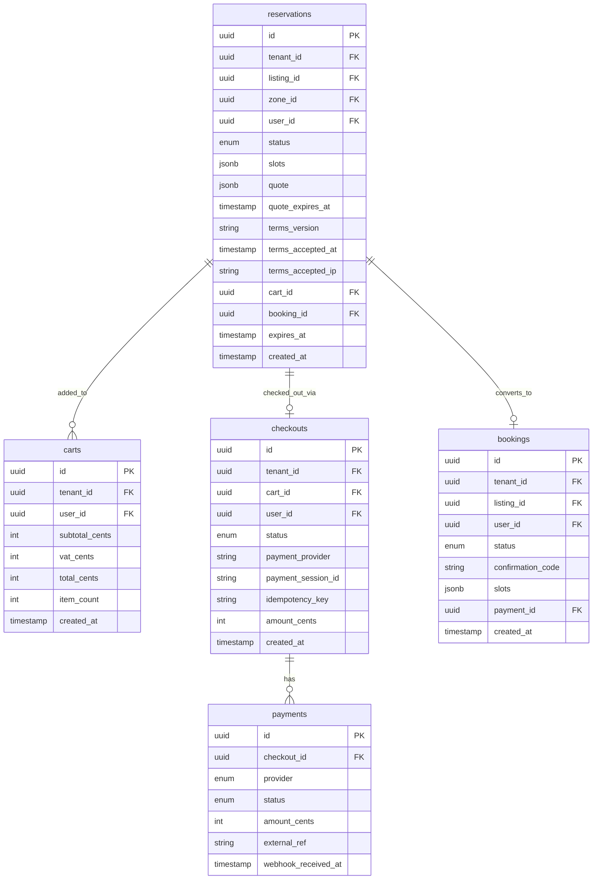

---
source: docs/knowledge_base/requirements/BOOKING_FLOW_ARCHITECTURE.md
auto_indexed: true
indexed_at: 2025-12-27T01:56:47.200Z
---

---
source: digilist/docs/plans/BOOKING_FLOW_ARCHITECTURE.md
auto_indexed: true
indexed_at: 2025-12-27T01:56:47.174Z
---

# Digilist Booking Flow - Architecture Documentation

> Last Updated: 2025-12-23

## Overview

The Digilist booking flow enables citizens to reserve municipal listings through a multi-step process that supports three payment policies, approval workflows, and compliance requirements.

---

## System Architecture

```mermaid
graph TB
    subgraph Frontend["Frontend (React Router)"]
        FC[Listing Calendar]
        CB[Confirm Booking Page]
        CP[Cart Page]
        BC[Booking Confirmation]
    end

    subgraph API["API Layer (Hono)"]
        RA[/api/v1/reservations]
        CA[/api/v1/cart]
        WH[/api/v1/webhooks/payments]
    end

    subgraph Services["Core Services"]
        RS[Reservation Service]
        CS[Checkout Service]
        PS[Payment Providers]
    end

    subgraph Database["PostgreSQL + Drizzle"]
        RES[(reservations)]
        CART[(carts)]
        CHK[(checkouts)]
        BK[(bookings)]
        PAY[(payments)]
    end

    subgraph External["External Services"]
        VP[Vipps ePayment]
        ST[Stripe]
        NT[Nets]
    end

    FC --> CB
    CB --> CP
    CP --> BC

    FC --> RA
    CB --> RA
    CP --> CA
    
    RA --> RS
    CA --> CS
    WH --> CS

    RS --> RES
    CS --> CHK
    CS --> CART
    CS --> BK
    CS --> PAY

    PS --> VP
    PS --> ST
    PS --> NT

    VP --> WH
    ST --> WH
    NT --> WH
```

---

## User Journey Flow



---

## Reservation State Machine



---

## Payment Policy Flows

### Policy 1: PAY_AND_CONFIRM (Default)



Most listings use this policy. Payment is required and booking is immediately confirmed upon successful payment.

### Policy 2: APPROVE_THEN_PAY



Used for listings requiring administrative approval before payment. User doesn't pay until approved.

### Policy 3: PAY_THEN_APPROVE



Used for high-demand listings. Payment is held pending approval. Automatic refund if rejected.

---

## Database Schema



---

## API Endpoints

### Reservations

| Method | Path | Description |
|--------|------|-------------|
| `POST` | `/api/v1/reservations` | Create draft reservation |
| `GET` | `/api/v1/reservations/:id` | Get reservation details |
| `PATCH` | `/api/v1/reservations/:id` | Update purpose, message, add-ons |
| `POST` | `/api/v1/reservations/:id/quote` | Generate server-side quote |
| `POST` | `/api/v1/reservations/:id/accept-terms` | Accept terms with audit |
| `POST` | `/api/v1/reservations/:id/add-to-cart` | Add to shopping cart |
| `DELETE` | `/api/v1/reservations/:id` | Cancel reservation |

### Cart

| Method | Path | Description |
|--------|------|-------------|
| `GET` | `/api/v1/cart` | Get current cart |
| `DELETE` | `/api/v1/cart/items/:itemId` | Remove item from cart |
| `POST` | `/api/v1/cart/checkout` | Initiate checkout |

### Webhooks

| Method | Path | Description |
|--------|------|-------------|
| `POST` | `/api/v1/webhooks/payments/vipps` | Vipps payment callback |
| `POST` | `/api/v1/webhooks/payments/test` | Test webhook (dev only) |

---

## File Structure

```
digilist-packages/packages/
├── db/
│   ├── src/schema/reservations.ts       # Table definitions
│   ├── src/repositories/reservations.repository.ts
│   └── drizzle/0004_add_reservations_flow.sql
│
├── core/src/services/
│   ├── reservation.service.ts           # Reservation lifecycle
│   ├── checkout.service.ts              # Checkout orchestration
│   └── payment-providers/
│       ├── types.ts                     # Provider interface
│       ├── vipps.adapter.ts             # Vipps implementation
│       └── index.ts                     # Exports

digilist-api/src/routes/v1/
├── reservations.ts                      # Reservation endpoints
├── cart.ts                              # Cart endpoints
└── webhooks/payments.ts                 # Payment webhooks

digilist-frontend/app/
├── services/booking.service.ts          # API client
├── routes/confirm-booking.tsx           # Confirmation page
└── routes/cart.tsx                      # Cart page
```

---

## Security & Compliance

### Terms Acceptance Audit

Every terms acceptance logs:
- **User ID** - Who accepted
- **Reservation ID** - What was accepted for
- **Terms Version** - Which version was accepted
- **IP Address** - From where
- **User Agent** - Which browser/device
- **Timestamp** - When exactly

### Idempotency

All write operations support idempotency keys to prevent duplicate:
- Reservations
- Payments
- Bookings

### Row Level Security

PostgreSQL RLS policies ensure:
- Users can only see their own reservations/carts
- Tenant isolation is enforced at database level
- Admin overrides for backoffice operations

---

## Timeouts

| Item | Duration | Action on Expiry |
|------|----------|------------------|
| Draft reservation | 30 minutes | Auto-expire, release slots |
| Quote | 15 minutes | Must regenerate quote |
| Payment session | 10 minutes | Checkout expires |
| Cart item | 24 hours | Auto-remove from cart |

---

## Error Handling

| Code | Error | Description |
|------|-------|-------------|
| `409` | `SLOT_CONFLICT` | Slots no longer available |
| `409` | `QUOTE_EXPIRED` | Quote validity expired |
| `400` | `TERMS_NOT_ACCEPTED` | Must accept terms first |
| `400` | `TERMS_VERSION_MISMATCH` | Wrong terms version |
| `422` | `RULE_VIOLATION` | Violates listing booking rules |
| `500` | `RECONCILIATION_REQUIRED` | Payment OK but booking failed |

---

## Testing

```bash
# Run API
cd digilist-api && pnpm dev

# Run Frontend
cd digilist-frontend && pnpm dev

# Test flow
# 1. Navigate to /listing/:id
# 2. Select time slot on calendar
# 3. Click "Book" to create reservation
# 4. Review quote on /confirm-booking
# 5. Accept terms and add to cart
# 6. Go to /cart and checkout
# 7. Complete payment (Vipps sandbox)
# 8. View confirmation
```

---

## Related Documents

- [BOOKING_FLOW_STATE_MACHINE.md](./BOOKING_FLOW_STATE_MACHINE.md) - Detailed state diagram
- [BOOKING_FLOW_API_CONTRACTS.md](./BOOKING_FLOW_API_CONTRACTS.md) - OpenAPI specs
- [BOOKING_FLOW_IMPLEMENTATION_GUIDE.md](./BOOKING_FLOW_IMPLEMENTATION_GUIDE.md) - Developer guide
- [BOOKING_FLOW_ACCEPTANCE_CRITERIA.md](./BOOKING_FLOW_ACCEPTANCE_CRITERIA.md) - Test scenarios
- [BOOKING_FLOW_IMPLEMENTATION_STATUS.md](./BOOKING_FLOW_IMPLEMENTATION_STATUS.md) - Progress tracker
